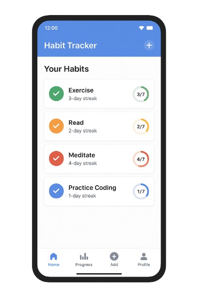

# Habit Tracker App

A **Habit Tracker App** built with **Kotlin**, **MVVM architecture**, and **Room database** for Android in 2022.
This app helps users track daily habits, maintain streaks, and visualize progress.

---

## 🛠️ Technologies & Tools
- **Language:** Kotlin  
- **Architecture:** MVVM (Model-View-ViewModel)  
- **Database:** Room (SQLite)  
- **UI:** Material Design, RecyclerView  
- **IDE:** Android Studio  

---

## ⚡ Features
- Add, edit, and delete habits  
- Track daily progress and streaks  
- Mark habits as done/not done each day  
- Persistent storage using Room  
- Clean and responsive Material Design UI  

---

## 📁 Project Structure

```
habit-tracker-full/
├── app/ # Android app module
├── build.gradle
├── settings.gradle
├── README.md
└── ...other project files
```


